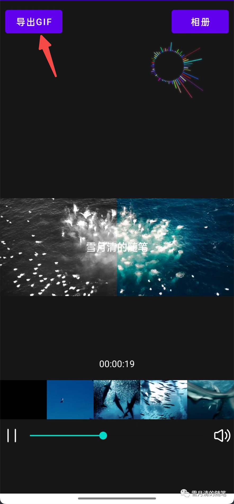

# ffmpeg-demo

基于FFMpeg5.0.1版本的学习型Demo，实现了通过FFMpeg提供的硬解和软解两种方式进行音视频文件的渲染和播放

滤镜效果包括：圆角滤镜和灰度滤镜

文章原创首发于微信公众号“雪月清的随笔”，欢迎关注

[Android FFmpeg系列01--编译与集成](https://mp.weixin.qq.com/s/pV4vUWmWbnzBK7qizr6YEw)

[Android FFmpeg系列02--音视频基础](https://mp.weixin.qq.com/s/9k4XBZR1i8LpgWt9jR8IvA)

[Android FFmpeg系列03--视频解码与渲染](https://mp.weixin.qq.com/s/cBZcUhZDiZVTXDY4jAWt7Q)

[Android FFmpeg系列04--FFmpeg调用MediaCodec进行硬解码](https://mp.weixin.qq.com/s/mrBiiDT5jvsDDmAJK34TLA)

[Android FFmpeg系列05--音频解码与播放](https://mp.weixin.qq.com/s/fnESmyGDv2iHTE1DxjZ8Kg)

[Android FFmpeg系列06--音频可视化](https://mp.weixin.qq.com/s/xdHyc_E3qdOFxVjRpMxLZA)

[Android FFmpeg系列07--音画同步](https://mp.weixin.qq.com/s/DMScDxucdT_MadChxPgxDQ)

[Android FFmpeg系列08--seek和精准seek](https://mp.weixin.qq.com/s/mSJJdsU8b3HlSq-SgwVl_g)

[Android FFmpeg系列09--抽帧和快速抽帧](https://mp.weixin.qq.com/s/sCGnlxCigKSZwLhuowCk8w)

[FFmpeg filter浅析--上篇](https://mp.weixin.qq.com/s/6PosJFajEvj4sWId_646MQ)

[FFmpeg filter浅析--中篇](https://mp.weixin.qq.com/s/cQoFUByosBG11U770UHopA)

[FFmpeg filter浅析--下篇](https://mp.weixin.qq.com/s/Cz9-KtW1iOLjzHIyC1kstQ)

[FFmpeg系列连载阶段性总结](https://mp.weixin.qq.com/s/B8kqqlXujaIi2KtSWsmA5g)

[编译ffplay并导入IDE断点调试](https://mp.weixin.qq.com/s/hJlRr1MNRuU5QAjTD3ehxw)

[Android FFmpeg系列10--seek优化](https://mp.weixin.qq.com/s/XVN39t_vHn8gaG_ATwaDGA)

[Android FFmpeg系列11--解码遇到EAGAIN的正确处理姿势](https://mp.weixin.qq.com/s/c7VZ53M9t7rSLoWB5WVIVA)

[Android FFmpeg系列12--导出GIF](https://mp.weixin.qq.com/s/AiTrnUOALXPHvptvMBy0Ag)

[从一个NV12渲染错误的issue说起](https://mp.weixin.qq.com/s/rsZGqKxS-LsPL8M8O537Sw)